# MySQL-Insurance-Claim-Analysis
**Insurance Claim Analysis: Demographic and Health**

This project performs an in-depth analysis of an insurance claims dataset, focusing on demographic and health-related factors to derive actionable insights. The analysis utilizes MySQL queries to extract, transform, and analyze the data, demonstrating strong proficiency in SQL for data manipulation and reporting.

**DataSet Source:**
* **Google Sheets:** [https://docs.google.com/spreadsheets/d/e/2PACX-1vRa1wWwXmzxEvqITxj4OQTeLywlGTTsOTbhSRqKj2lPuGefjlci-DQhgLBPpgWXe8AAUu2WUBqY59X1/pub?gid=1030172542&single=true&output=csv](https://docs.google.com/spreadsheets/d/e/2PACX-1vRa1wWwXmzxEvqITxj4OQTeLywlGTTsOTbhSRqKj2lPuGefjlci-DQhgLBPpgWXe8AAUu2WUBqY59X1/pub?gid=1030172542&single=true&output=csv)
* **Kaggle:** [https://www.kaggle.com/datasets/thedevastator/insurance-claim-analysis-demographic-and-health?select=insurance_data.csv](https://www.kaggle.com/datasets/thedevastator/insurance-claim-analysis-demographic-and-health?select=insurance_data.csv)

**Key Analyses Performed:**

The following SQL queries were executed to explore the dataset and answer specific business questions:

**1. Filtering Records for Male Patients from the 'southwest' Region:**
    * This query retrieves all data entries for male patients residing in the 'southwest' geographical region.
    * 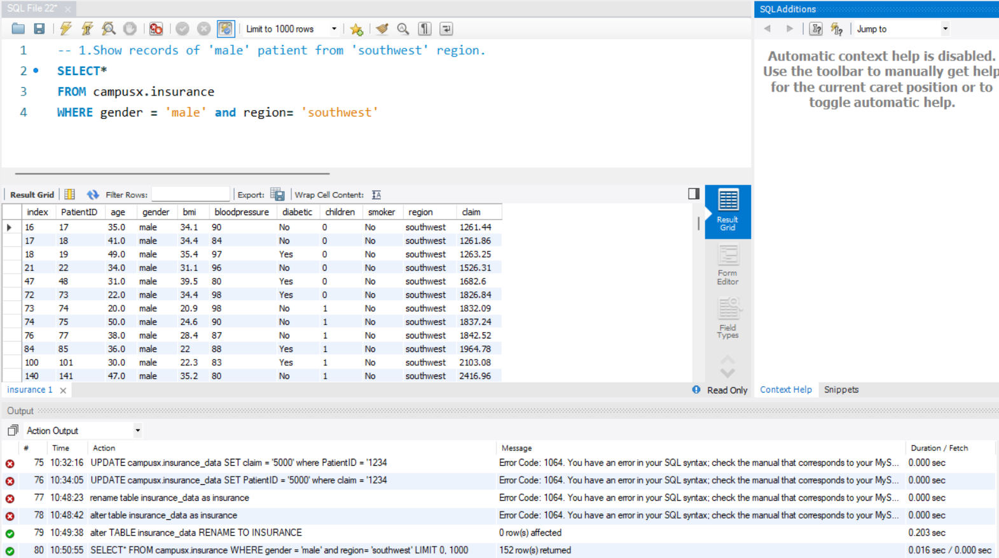

**2. Identifying Patients with BMI in a Specific Range (30 to 45 Inclusive):**
    * Retrieves records for patients whose Body Mass Index (BMI) falls within the range of 30 to 45 (inclusive), useful for identifying overweight or obese individuals.
    * 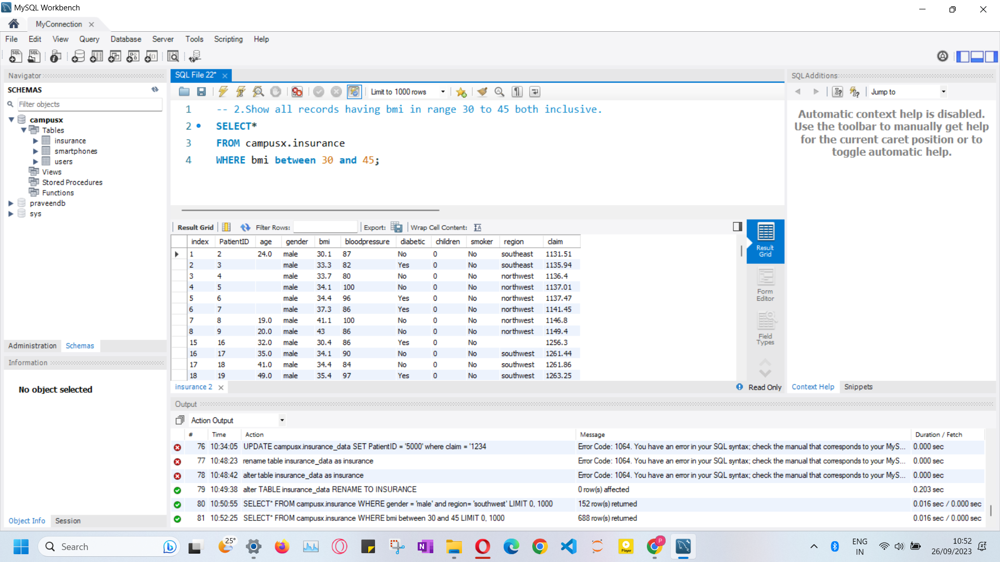

**3. Determining Minimum and Maximum Blood Pressure for Diabetic Smokers:**
    * Calculates the lowest and highest recorded blood pressure values among patients who are both diabetic and smokers, aliased as `MinBP` and `MaxBP` respectively. This highlights health extremes in a high-risk group.
    * 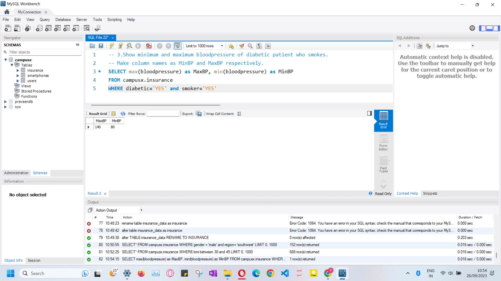

**4. Counting Unique Patients Outside the 'southwest' Region:**
    * Finds the total number of distinct patients who are not from the 'southwest' region, providing insight into geographical distribution of the patient base.
    * 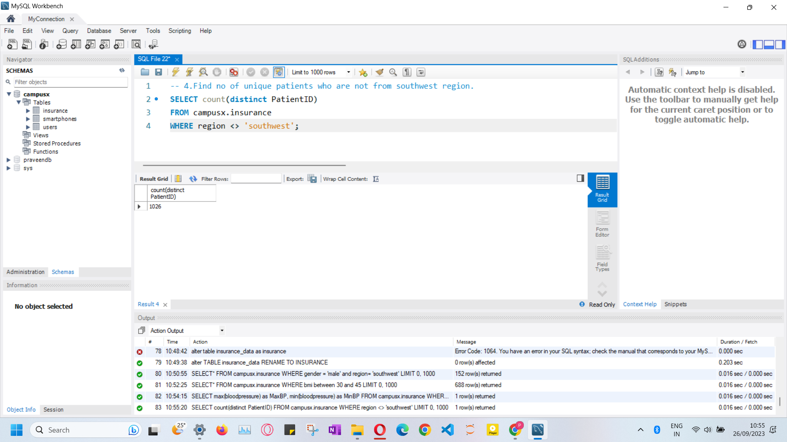

**5. Calculating Total Claim Amount from Male Smokers:**
    * Aggregates the total claim amounts filed by male patients who are smokers, useful for assessing financial impact from this specific demographic.
    * 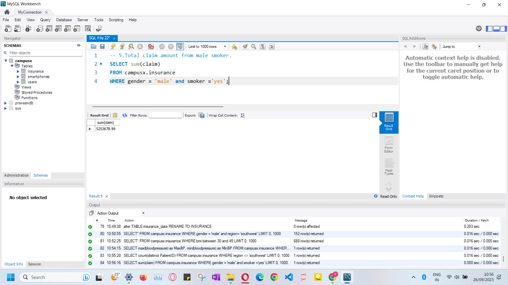

**6. Retrieving All Records from the 'south' Region:**
    * Selects all patient records originating from any sub-region within the 'south' category (e.g., 'southeast', 'southwest').
    * 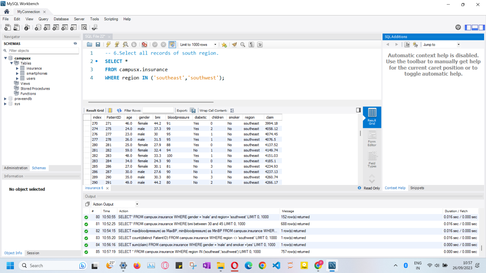

**7. Counting Patients with Normal Blood Pressure (Standard Range):**
    * Determines the number of patients whose blood pressure falls within the commonly accepted normal range of 90 to 120.
    * 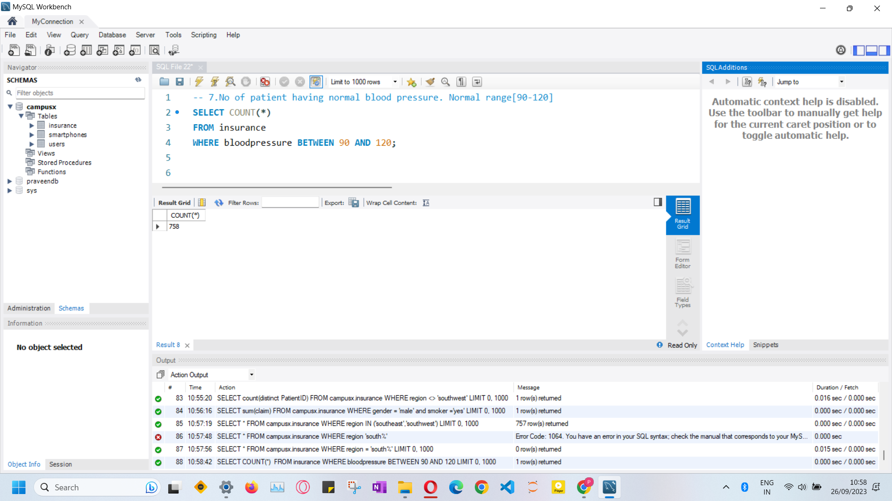

**8. Counting Patients Under 17 with Age-Adjusted Normal Blood Pressure:**
    * Counts patients under 17 years of age who have blood pressure within an age-adjusted normal range, calculated using the formula: `80 + (age * 2)` to `100 + (age * 2)`.
    * *Note: This formula is for illustrative practice purposes only and should not be taken as medical advice.*
    * 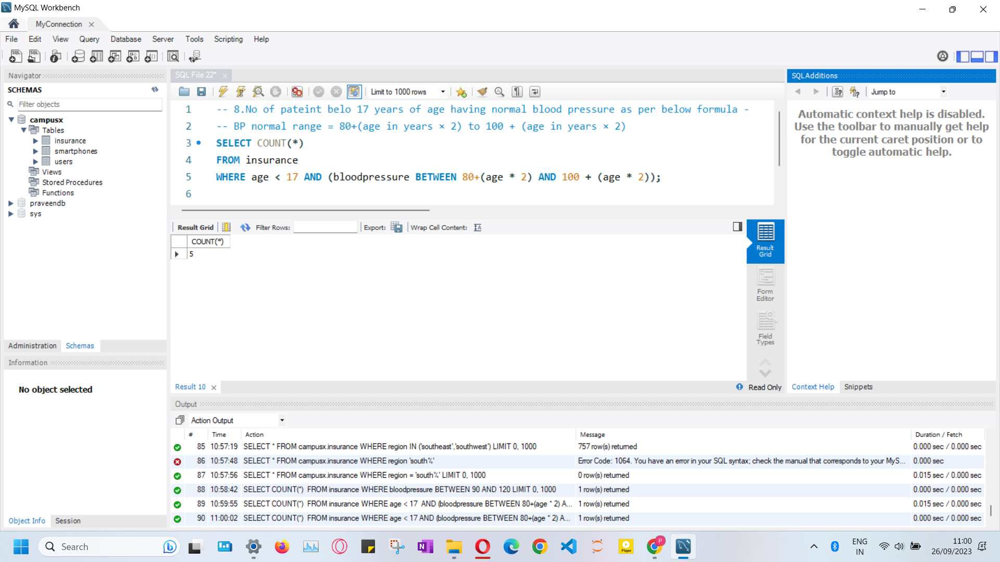

**9. Calculating Average Claim Amount for Non-Smoking, Diabetic Female Patients:**
    * Computes the average claim amount for a specific high-risk group: non-smoking female patients who are diabetic.
    * 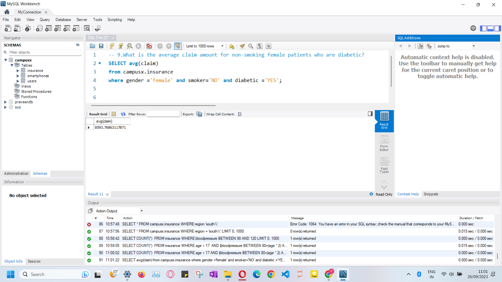

**10. Updating Claim Amount for a Specific Patient:**
    * Demonstrates DML `UPDATE` operation by changing the `claim` amount for the patient with `PatientID = 1234` to 5000.
    * 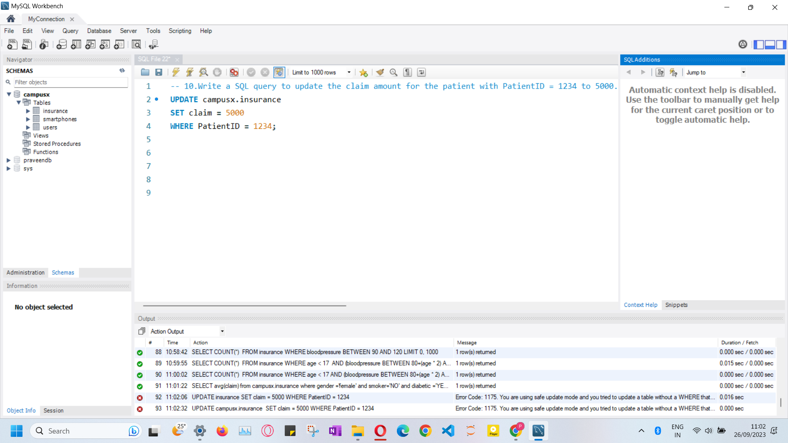

**11. Deleting Records for Smokers with No Children:**
    * Illustrates DML `DELETE` operation by removing all patient records who are smokers and have no children, useful for data maintenance or specific analysis scenarios.
    * 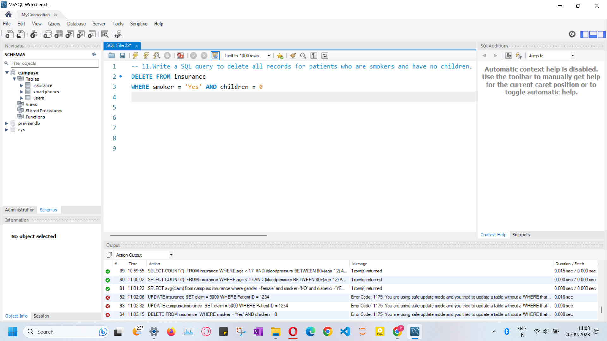
